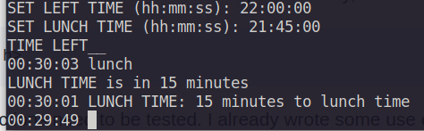

# Count Down

## Introduction
Are you having a problem to not get bored at work? And the only thing you want while working is to go home. Let the count down c++ console application helps you with that. The application was designed with that and only that purpose. For any purposes beside, please don't use it. 

## Installation
- Download the source code and put it anywhere you want on your device.
- Open that directory then compile and run the program. I use gcc compiler, you can use any compiler you have. 
    - **compile**
    ``
    g++ main.cpp -pthread -o m 
    ``
    - **run**
    ``
    ./m
    ``
    
 Or you can just run ``m.exe`` file and that's no need to compile first.

## User guide

SET LEFT TIME (hh:mm:ss): This is where you set the time you go home. The application will output the countdown time to go home every seconds.  **Please follow the input format**

**example**
``
17:28:00
``

SET LUNCH TIME (hh:mm:ss): This is where you set the time you have lunch. The system will automatically announce for every minutes when it's less than 30 minutes to the lunch time, 

**example**
``
12:13:00
``

You also have an option to output the count down to lunch time by typing "lunch" on the screen. The screen will show you how long to the lunch time (in minutes)

Please reference to the image below to see how it works. 




## Testing
Please install the [Google Test](https://github.com/google/googletest) first to be able to use the ``gtest`` library, which I included at the head of the testing file

```
#include <gtest/gtest.h>
```

The program has some functions need to be tested. I already wrote some use cases to test those functions. Run the ``test_time.cpp`` file. Or you can modify it and write some more test cases.

**compile**

``
g++ testing.cpp -lgtest -lpthread
``

**run**

``
./a.out
``
